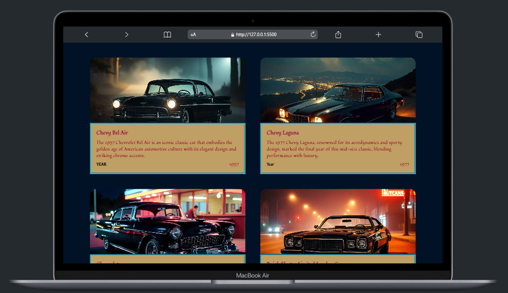

# Classic Car Grid Card Design Using SASS

This project demonstrates a modern, responsive grid card layout to showcase classic cars. The design features images, car names, descriptions, and the year of manufacture, styled with SASS and arranged using CSS Grid for a clean and flexible layout.

## Screenshot

## Features

- **Responsive design**: Adapts to different screen sizes using CSS Grid and media queries.
- **Modern design**: Clean and minimal style for displaying car details.
- **Modular CSS**: Utilizes SASS for organized and maintainable styles.

## Technologies Used

- **HTML**: Markup for structuring the content.
- **SASS**: For organizing and styling the CSS.
- **CSS Grid**: For a flexible and responsive grid layout.

## License

This project is licensed under the [MIT License](LICENSE).
